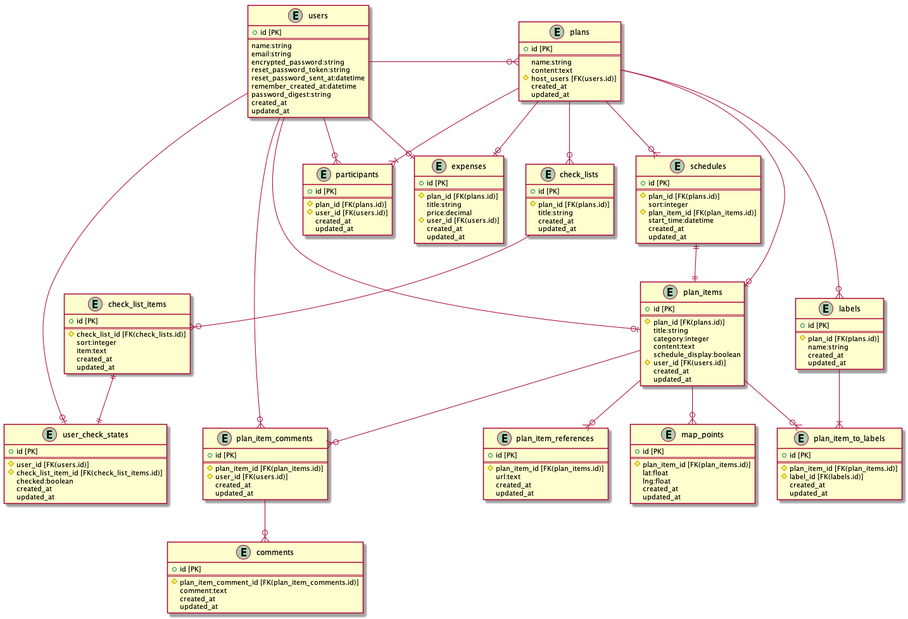

# OurTrip
## 概要
Webを介して旅行を計画する際に、その手助けを行う。
- 旅行に行くけど、行先は決まっていない
  - このサービスに行きたい箇所を登録しましょう！
  - みんなが投稿した行先から旅のしおりを作成しましょう！
## バージョン情報
- Rails
  - 5.2.4
- Ruby
  - 2.6.5
- PostgreSQL
  - 12.2

## 機能一覧
- ユーザー機能
  - ユーザー情報の登録
  - ユーザー情報の編集
- プラン
  - 各ユーザーが行きたい場所を登録する
  - 上記で作成したプランを作成する
- チェックリスト
  - チェックリストを作成する
  - チェックリストをチェックする
  - チェックリストを確認する
- 会計
  - 掛かった費用を登録する
  - 費用を割り勘する際の金額を表示する

## 設計
- カタログ設計
  - https://docs.google.com/spreadsheets/d/1_9TniFWZGfS6F2vsR7lUj-vMjea6-rJn-6nDzZYDYkA/edit#gid=0
- テーブル設計
  - https://docs.google.com/spreadsheets/d/18lUxXdxaolQJIts1rn7-lgO6FVkM5VKDpLO4Kf37GhE/edit?usp=sharing
- ER図
  - doc/table.puml
  - 
- 画面遷移
  - doc/diagram.dio
  - https://drive.google.com/file/d/11LLMA9KLCp-rBKegX-YBOtMf_M2O6-Ao/view?usp=sharing
- 画面設計
  - doc/screen.dio
  - https://drive.google.com/file/d/1NrgDaCkWMpHfCc_lyGMe710cn_S7GN9m/view?usp=sharing

## 使用予定Gem
- react-rails
- webpacker
- activerecord-import

## 使用技術
- 就業Term
  - AWS
  - devise
- 就業Term外
  - Docker

## Dockerに関して
- 手順
  1. docker-compose up -d
  1. docker-compose exec web bash
  1. bundle install
  1. rails db:create
  1. rails db:migrate
  1. rails s -b 0.0.0.0

- コマンドに関して
  - イメージの作成
    - docker build .
  - コンテナの起動
    - docker run -it -v /Users/matsumoto/workspace/portfolio/our_trip:/our_trip <image> bash
  - composeイメージの作成
    - docker-compose up -d
  - composeの起動
    - docker-compose exec web bash
  - 全削除
    - image
      - docker images -aq | xargs docker rmi
    - コンテナ
      - docker ps -aq | xargs docker rm

### psqlに関して
1. docker-compose exec db bash
1. su postgres
1. psql our_trip_development

## AWSに関して
- デプロイ
  - bundle exec cap production deploy

## Seedデータ登録時にIDがずれる問題に関して
rails db:seedを実施した後、稀にIDがズレるためズレるため
- SELECT setval('users_id_seq', (SELECT MAX(id) FROM users));
- SELECT setval('plans_id_seq', (SELECT MAX(id) FROM plans));
- SELECT setval('plan_items_id_seq', (SELECT MAX(id) FROM plan_items));
- SELECT setval('schedules_id_seq', (SELECT MAX(id) FROM schedules));

